# Student Registration System

A Laravel-based Student Registration System developed for **ITST 302 – Client-Server Technologies, Week 4 Laboratory Activity**.

The application provides a digital registration process where students can submit their personal, contact, and academic information, upload a profile picture, and securely save their registration data to a MySQL database.

The project demonstrates Laravel form processing, server-side validation, file uploads, database integration, flash messages, Blade templates, and the Laravel request lifecycle.

---

## Project Overview

Student registration is a common feature in universities and other enterprise information systems. Traditionally, registration may involve paper forms that require manual processing and record keeping. This project provides a simple digital alternative where student information can be collected, validated, stored, and viewed through a web-based application.

The Student Registration System was developed using Laravel and follows the Model-View-Controller structure. The system accepts student information through a Blade registration form, validates the submitted data on the server, stores uploaded profile pictures using Laravel Storage, saves student records in MySQL, and displays the registered student's information on a dedicated profile page.

A student records page is also included to provide an organized view of registered students.

---

## Objectives

The project was developed to accomplish the following objectives:

- Create a responsive student registration form using Laravel Blade templates.
- Process form submissions using Laravel controllers.
- Implement server-side validation for student information.
- Prevent duplicate Student IDs and email addresses.
- Validate uploaded profile pictures before storage.
- Upload and securely store student profile pictures using Laravel Storage.
- Store validated student information in a MySQL database.
- Display success notifications using Laravel flash messages.
- Display validation errors when invalid information is submitted.
- Display registered student information through a student profile page.
- Display registered students through a records page.
- Understand how requests move through the Laravel request lifecycle.
- Apply Git and GitHub for version control and project documentation.

---

## Technologies Used

The project uses the following technologies:

- **Laravel** – PHP web application framework
- **PHP** – Server-side programming language
- **MySQL** – Relational database management system
- **Laravel Blade** – Template engine used for the user interface
- **Laravel Validation** – Server-side input validation
- **Laravel Storage** – File upload and storage management
- **Tailwind CSS** – User interface styling
- **JavaScript** – Profile image preview and interface interactions
- **MySQL Workbench** – Database management and inspection
- **Git** – Version control
- **GitHub** – Source code repository and project portfolio
- **Visual Studio Code** – Development environment

---

## Main Features

The Student Registration System includes the following features:

### Student Registration Form

Students can provide the following information:

- Student ID
- First Name
- Middle Name
- Last Name
- Email Address
- Mobile Number
- Date of Birth
- Gender
- Program
- Year Level
- Complete Address
- Profile Picture

### Server-Side Validation

Laravel validates the submitted form before the information is stored in the database.

### Unique Student Records

Student IDs and email addresses must be unique to prevent duplicate registrations.

### Profile Picture Upload

Students are required to upload a valid JPG, JPEG, or PNG image with a maximum file size of 2 MB.

### Flash Messages

A success notification appears after a student has been registered successfully.

### Validation Error Messages

Invalid or missing information is displayed directly on the registration form so the user can correct it.

### Student Profile Page

After successful registration, the application redirects the user to a student profile page containing the registered information and uploaded profile picture.

### Student Records Page

Registered students are displayed through an organized records page with a search feature.

### Responsive Interface

The registration form, profile page, and records page are designed to work on desktop and smaller screen sizes.

---

# Laravel Request Lifecycle

Laravel processes a student registration request through several stages.

When a student opens the registration page, the browser sends a request to the Laravel application. Laravel matches the request to the appropriate route. The route then calls the corresponding method inside `StudentController`.

When the registration form is submitted, Laravel processes the POST request through the `store()` method. Before the student information is saved, the request is validated using Laravel's server-side validation rules.

If validation fails, Laravel redirects the user back to the registration form and provides validation error messages. Previously entered information is preserved using Laravel's `old()` helper.

If validation succeeds, the student's profile picture is stored using Laravel Storage. The file path is added to the validated information and the Student model creates a new record in the MySQL database.

After the record has been successfully stored, Laravel creates a flash success message and redirects the user to the student profile page.

This request flow demonstrates the interaction between the browser, routes, controller, validation, model, storage system, database, and response.

## Laravel Request Lifecycle Diagram

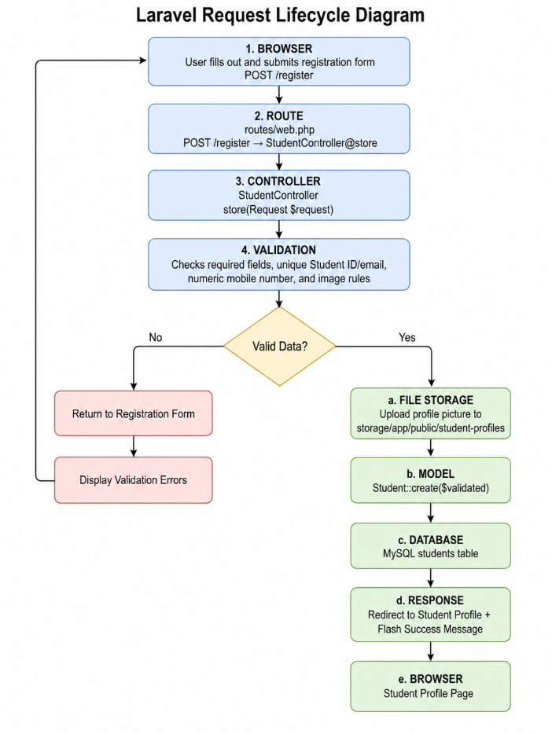

The registration request generally follows this flow:

```text
Student Browser
       |
       v
Blade Registration Form
       |
       v
POST /students
       |
       v
Laravel Route
       |
       v
StudentController
       |
       v
Server-Side Validation
       |
       +---------------------------+
       |                           |
     Invalid                     Valid
       |                           |
       v                           v
Validation Errors          Laravel Storage
       |                           |
       v                           v
Redirect Back             Store Profile Picture
                                   |
                                   v
                              Student Model
                                   |
                                   v
                             MySQL Database
                                   |
                                   v
                         Success Flash Message
                                   |
                                   v
                           Redirect Response
                                   |
                                   v
                         Student Profile Page
```

---

# Validation Rules

Validation is important because information submitted by users cannot automatically be trusted. Server-side validation ensures that the application processes only acceptable information before storing it in the database.

The project uses the following validation rules:

| Field | Validation |
|---|---|
| Student ID | Required, string, maximum 50 characters, unique |
| First Name | Required, string, maximum 100 characters, valid name characters |
| Middle Name | Optional, string, maximum 100 characters, valid name characters |
| Last Name | Required, string, maximum 100 characters, valid name characters |
| Email Address | Required, valid email, maximum 255 characters, unique |
| Mobile Number | Required, 10–11 digits |
| Date of Birth | Required, valid date, must be before today |
| Gender | Required, valid predefined option |
| Program | Required, string, maximum 150 characters |
| Year Level | Required, valid predefined year level |
| Address | Required, string, maximum 500 characters |
| Profile Picture | Required, image, JPG/JPEG/PNG, maximum 2 MB |

## Importance of the Validation Rules

### Required Fields

Required validation prevents important student information from being submitted empty.

### Unique Student ID

The Student ID uniquely identifies a student. The unique validation rule prevents two records from having the same Student ID.

### Unique Email Address

Preventing duplicate email addresses helps maintain accurate student records.

### Name Validation

The first, middle, and last name fields accept appropriate name characters while preventing unnecessary numeric values.

### Email Validation

Laravel checks that the submitted email follows a valid email format before accepting it.

### Mobile Number Validation

The application requires a mobile number containing the expected number of digits.

### Date Validation

The date of birth must contain a valid date and must occur before the current date.

### Image Validation

Laravel checks whether the uploaded profile picture is actually an image.

### File Type Restriction

Only JPG, JPEG, and PNG files are accepted.

### File Size Restriction

The maximum allowed profile picture size is 2 MB. Limiting the file size prevents unnecessarily large uploads and reduces storage usage.

---

# Database Design

Student information is stored inside the `students` table in MySQL.

Each student receives an automatically generated primary key named `id`. The `student_id` and `email` columns are unique to prevent duplicate student records.

Only the path of the uploaded profile picture is stored in the database. The actual file is stored through Laravel Storage.

## Students Table

| Column | Purpose |
|---|---|
| `id` | Primary key |
| `student_id` | Unique student identification number |
| `first_name` | Student's first name |
| `middle_name` | Optional middle name |
| `last_name` | Student's last name |
| `email` | Unique student email |
| `mobile_number` | Student contact number |
| `date_of_birth` | Student birth date |
| `gender` | Student gender |
| `program` | Academic program |
| `year_level` | Current year level |
| `address` | Complete student address |
| `profile_picture` | Stored image file path |
| `created_at` | Record creation timestamp |
| `updated_at` | Record update timestamp |

## Entity Relationship Diagram

The following ERD was generated from the database structure used by the application.

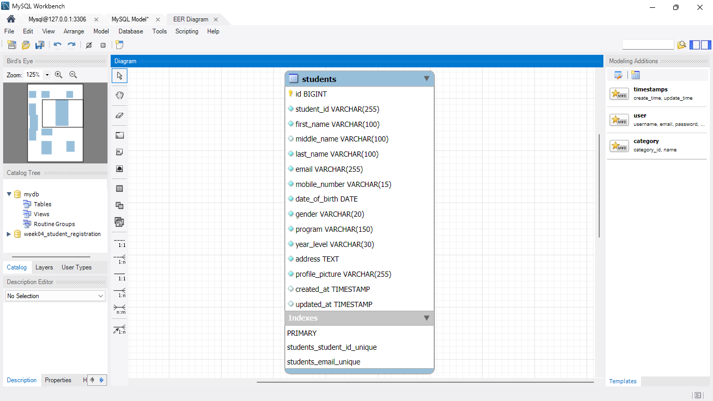

The current mini project requires only one main entity, `students`. The primary key is `id`, while `student_id` and `email` contain unique constraints.

---

# Registration Process Flowchart

The registration process begins when the user opens the registration page and completes the required information.

After submission, Laravel validates the request. Invalid submissions are returned to the registration form together with validation errors. Valid submissions proceed to profile picture storage and database insertion.

After the information has been stored successfully, Laravel creates a flash message and redirects the user to the student profile page.

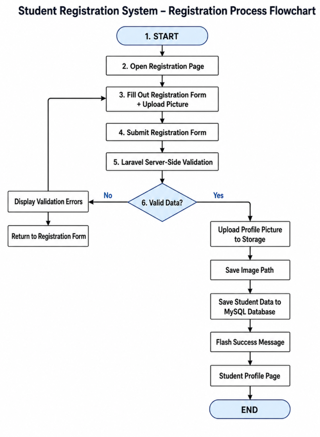

---

# Project Structure

Important project files are organized as follows:

```text
week04-student-registration/
|
├── app/
│   ├── Http/
│   │   └── Controllers/
│   │       └── StudentController.php
│   │
│   └── Models/
│       └── Student.php
│
├── database/
│   └── migrations/
│       └── create_students_table.php
│
├── documentation/
│   ├── laravel-request-lifecycle.png
│   ├── registration-flowchart.png
│   └── student-registration-erd.png
│
├── resources/
│   └── views/
│       └── students/
│           ├── create.blade.php
│           ├── index.blade.php
│           └── show.blade.php
│
├── routes/
│   └── web.php
│
├── screenshots/
│   ├── 01-registration-form.png
│   ├── 01-registration-form(1).png
│   ├── 02-validation-errors.png
│   ├── 02-validation-errors(1).png
│   ├── 03-successful-registration.png
│   ├── 04-flash-success-message.png
│   ├── 05-uploaded-profile-picture.png
│   ├── 06-database-records.png
│   ├── 07-student-profile-page.png
│   ├── 08-vscode-project-structure.png
│   ├── 09-terminal-output.png
│   ├── 10-browser-output.png
│   └── 11-github-repository.png
│
└── README.md
```

---

# Application Screenshots

## Registration Form

The registration page provides an organized interface where students can enter their personal, contact, and academic information.

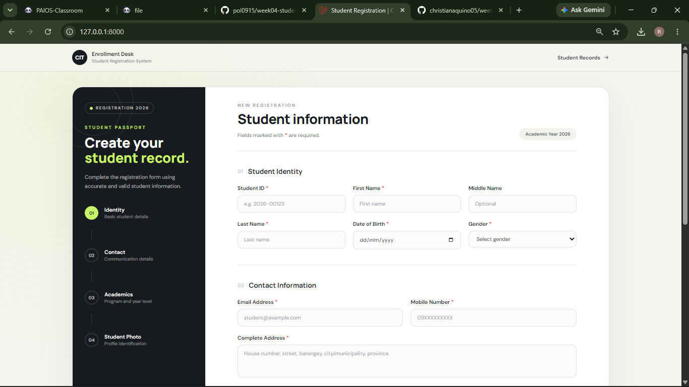

### Additional Registration Form View

.png)

---

## Validation Errors

Laravel displays validation messages when required or invalid information is submitted.

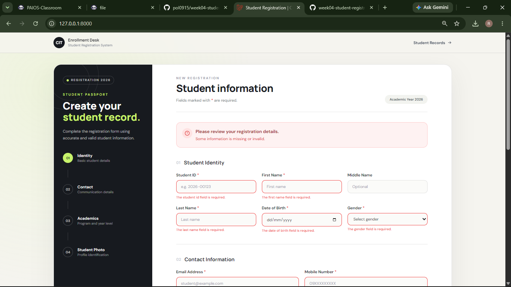

### Additional Validation Example

.png)

---

## Successful Registration

After valid information has been submitted and successfully stored, the application redirects the user to the registered student's profile.

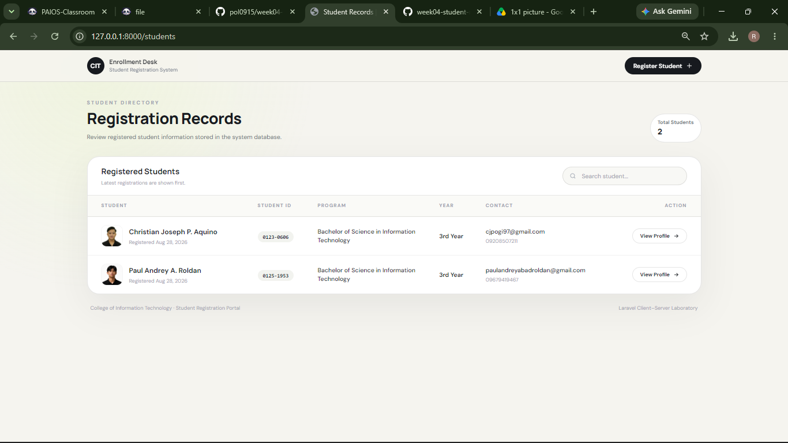

---

## Flash Success Message

Laravel session flash data is used to display a success notification after registration.

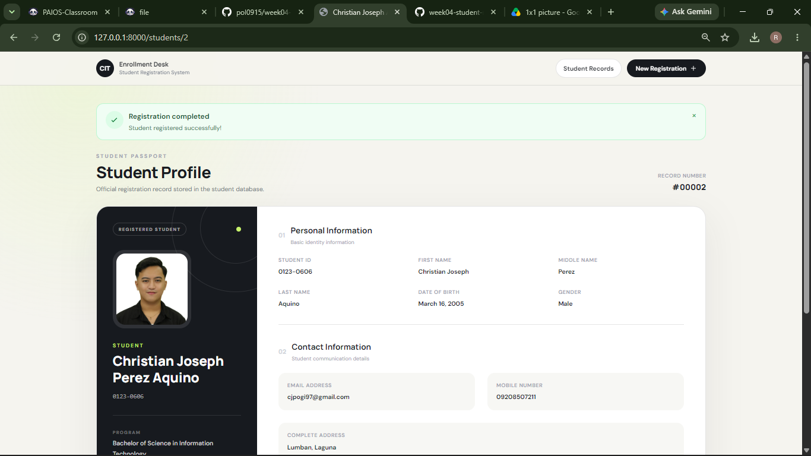

---

## Uploaded Profile Picture

The selected profile picture is stored using Laravel Storage and displayed after successful registration.

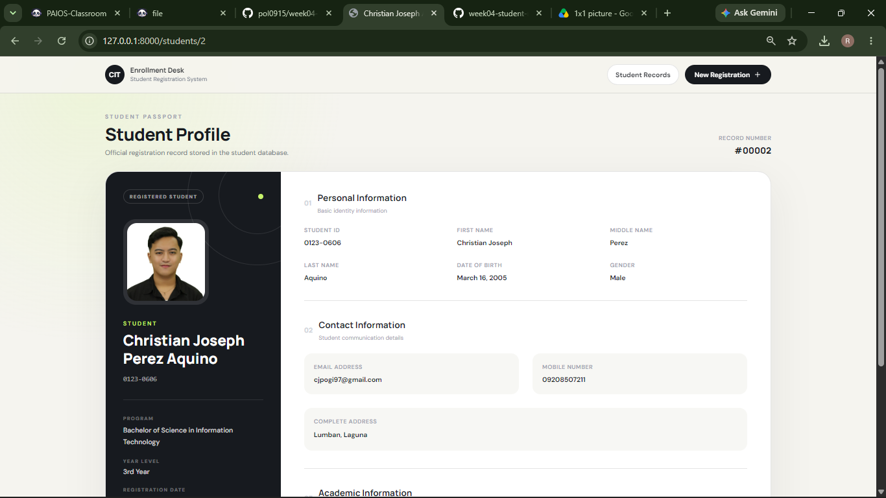

---

## Database Records

Registered student information is stored inside the MySQL `students` table.

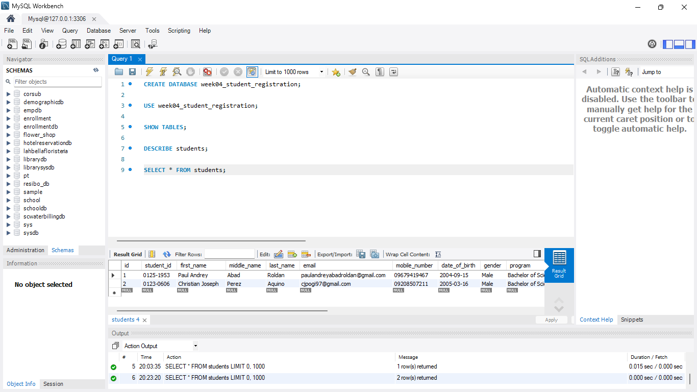

---

## Student Profile Page

The student profile page displays the information retrieved from the stored student record.


---

## Visual Studio Code Project Structure

The Laravel project follows an organized Model-View-Controller structure.

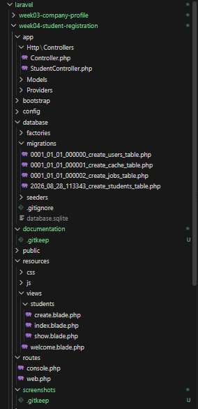

---

## Terminal Output

The terminal was used to execute Laravel Artisan commands, database migrations, Git commands, and application development tasks.

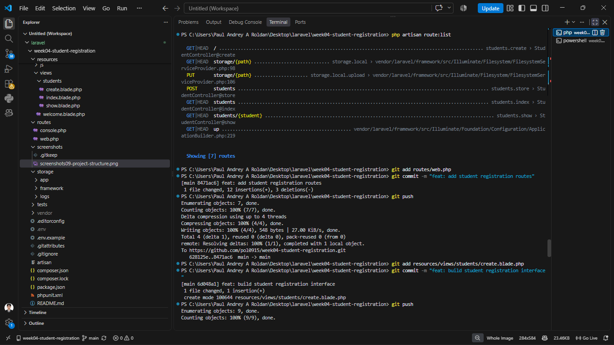

---

## Browser Output

The application was tested locally using Laravel's development server.

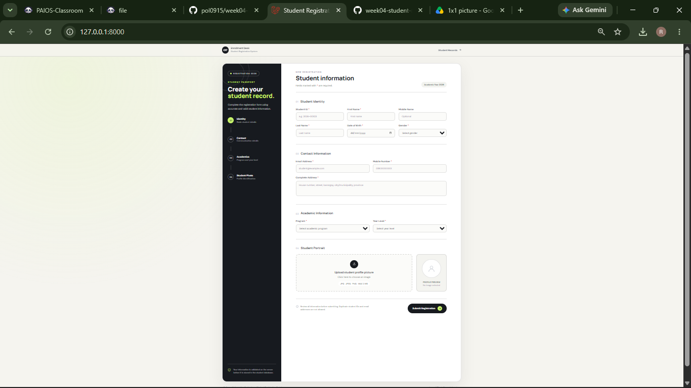

---

## GitHub Repository

Git and GitHub were used throughout development for source control and maintaining meaningful project commits.

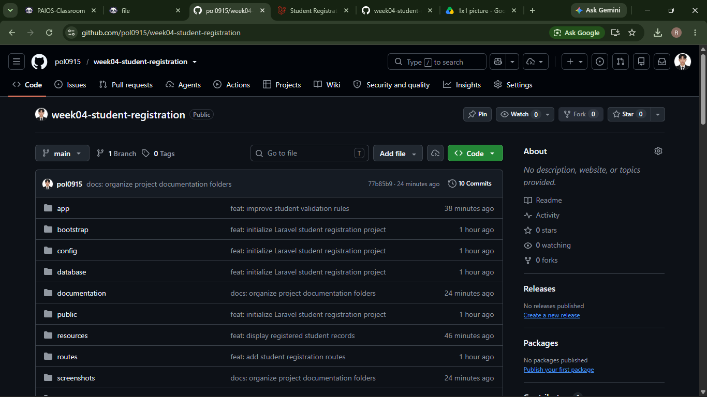

---

# File Upload Implementation

The student's profile picture is processed through Laravel's file upload system.

Uploaded files are stored in:

```text
storage/app/public/student-profiles/
```

Laravel's storage symbolic link was created using:

```bash
php artisan storage:link
```

This connects Laravel's public storage directory so uploaded images can be displayed in the browser.

The application stores only the image path in the `students` database table rather than storing the binary image directly inside MySQL.

An uploaded image is displayed using the stored path through Laravel's public storage link.

---

# Routes

The application includes routes for the main student registration operations.

| Method | URI | Route Name | Purpose |
|---|---|---|---|
| GET | `/` | `students.create` | Display registration form |
| POST | `/students` | `students.store` | Process student registration |
| GET | `/students` | `students.index` | Display student records |
| GET | `/students/{student}` | `students.show` | Display individual student profile |

---

# StudentController

The `StudentController` contains four primary methods.

### `create()`

Displays the student registration form.

### `store()`

Processes the submitted request, validates student information, uploads the profile picture, saves the student record, creates the flash message, and redirects to the student profile.

### `index()`

Retrieves registered students from the database and displays them through the student records page.

### `show()`

Retrieves and displays a specific registered student's information.

---

# Problems Encountered

During the development of the project, several challenges were encountered.

## 1. Creating the Database from PowerShell

Initially, the SQL command for creating the database was entered directly inside PowerShell. PowerShell interpreted `CREATE` as a PowerShell command instead of an SQL statement, resulting in a command-not-found error.

## 2. Configuring Laravel with MySQL

The Laravel application needed the correct database connection settings before migrations could be executed. Incorrect or incomplete database configuration would prevent Laravel from connecting to MySQL.

## 3. Displaying Uploaded Profile Pictures

Profile pictures stored in Laravel's storage directory are not automatically accessible from the browser. Without a public storage link, the uploaded image cannot be displayed normally.

## 4. Handling Invalid Student Information

The registration form needed clear validation rules so invalid names, duplicate IDs, duplicate emails, incomplete fields, incorrect email formats, and invalid profile pictures would not be stored in the database.

---

# Solutions

## 1. Using MySQL Workbench for SQL Commands

Instead of executing SQL directly in PowerShell, the database was created using MySQL Workbench. Laravel was then configured to connect to the created database.

## 2. Updating the Laravel Environment Configuration

The `.env` configuration was updated with the correct MySQL database name, host, port, username, and password. Laravel migrations were then executed successfully.

Example database configuration:

```env
DB_CONNECTION=mysql
DB_HOST=127.0.0.1
DB_PORT=3306
DB_DATABASE=week04_student_registration
DB_USERNAME=root
DB_PASSWORD=
```

The configuration cache was also cleared when necessary using:

```bash
php artisan config:clear
```

## 3. Creating the Laravel Storage Link

The following Artisan command was executed:

```bash
php artisan storage:link
```

This created a connection between `public/storage` and `storage/app/public`, allowing uploaded images to be displayed through the browser.

## 4. Implementing Laravel Server-Side Validation

Validation rules were added to the `store()` method of `StudentController`. Custom validation messages were also included to provide clear feedback to the user when information was missing or invalid.

---

# Reflection

Developing the Student Registration System helped me better understand how client-server applications process information submitted by users. Before working on this project, a registration form could easily appear to be only a collection of input fields and a submit button. However, this activity showed me that several important processes happen behind the interface before information can safely be stored in a database.

One of the most important lessons I learned was the importance of validation. A system should not immediately trust information sent by a client. Users can accidentally leave fields blank, enter incorrect information, reuse an existing Student ID, submit an invalid email address, or upload an unsupported file. Laravel's server-side validation provides a way to check these conditions before any data is added to the database. This makes the stored records more consistent and helps protect the application from incorrect input.

I also learned the difference between client-side and server-side validation. Client-side validation can make a form easier to use because errors may be detected quickly in the browser. However, client-side checks should not be the only protection because they can be bypassed or modified. Server-side validation is more reliable because the submitted request is checked by the application before it reaches the database. Using both approaches can improve the user experience, but the server should remain responsible for deciding whether submitted information is acceptable.

Another important part of the activity was file handling. Uploading a profile picture requires more than simply accepting a file from the user. The system needs to check whether the uploaded file is an accepted image type and whether its size is within the allowed limit. I learned how Laravel Storage separates uploaded files from database information. Instead of saving an entire image in MySQL, the application stores the file in the storage directory and saves only its path in the student record. The `storage:link` command then makes files inside public storage available to the browser.

The project also improved my understanding of Laravel's request lifecycle. When a user submits the registration form, the request moves from the browser to a Laravel route, then to the controller. The controller validates the request, uses the model to communicate with the database, stores the uploaded file, and finally returns a response to the browser. Seeing this process in an actual working application made the relationship between the client, server, controller, model, and database easier to understand.

Registration systems are commonly used in universities, companies, hospitals, banks, government systems, and many other enterprise applications. These systems need accurate information, proper validation, secure file handling, and reliable database storage. Completing this project showed me that even a relatively simple registration feature uses many concepts that are important in real-world software development. It also strengthened my understanding of Laravel, MySQL, Git, request processing, validation, and secure handling of user input.

---

# Installation and Setup

To run the project locally, follow the steps below.

## 1. Clone the Repository

```bash
git clone https://github.com/pol0915/week04-student-registration.git
```

## 2. Enter the Project Directory

```bash
cd week04-student-registration
```

## 3. Install PHP Dependencies

```bash
composer install
```

## 4. Create the Environment File

```bash
copy .env.example .env
```

For macOS or Linux:

```bash
cp .env.example .env
```

## 5. Generate the Application Key

```bash
php artisan key:generate
```

## 6. Create the MySQL Database

Create:

```sql
CREATE DATABASE week04_student_registration;
```

## 7. Configure `.env`

```env
DB_CONNECTION=mysql
DB_HOST=127.0.0.1
DB_PORT=3306
DB_DATABASE=week04_student_registration
DB_USERNAME=root
DB_PASSWORD=
```

Update the username and password if your local MySQL server uses different credentials.

## 8. Run Database Migrations

```bash
php artisan migrate
```

## 9. Create the Storage Link

```bash
php artisan storage:link
```

## 10. Start the Laravel Development Server

```bash
php artisan serve
```

Open the application in the browser:

```text
http://127.0.0.1:8000
```

---

# Git and GitHub

Git was used throughout the project to document meaningful stages of development.

Examples of meaningful commits include:

```text
feat: initialize Laravel student registration project
feat: configure student model
feat: implement student controller
feat: add student registration routes
feat: build student registration interface
feat: display registered student profile
feat: display registered student records
feat: improve student validation rules
docs: organize project documentation folders
docs: add registration system diagrams
docs: complete project README
```

Using meaningful commits makes it easier to understand how the application developed over time and provides a more organized project history.

---

# Repository

**GitHub Repository:**

https://github.com/pol0915/week04-student-registration

---

# References

Laravel. (n.d.). *Laravel documentation*. https://laravel.com/docs

MDN Web Docs. (n.d.). *Client-side form validation*. Mozilla. https://developer.mozilla.org/en-US/docs/Learn_web_development/Extensions/Forms/Form_validation

MDN Web Docs. (n.d.). *HTML forms*. Mozilla. https://developer.mozilla.org/en-US/docs/Learn_web_development/Extensions/Forms

MySQL. (n.d.). *MySQL 8.4 reference manual*. Oracle. https://dev.mysql.com/doc/refman/8.4/en/

PHP. (n.d.). *PHP manual*. https://www.php.net/manual/en/

Tailwind Labs. (n.d.). *Tailwind CSS documentation*. https://tailwindcss.com/docs

---

## Academic Project

**Course:** ITST 302 – Client-Server Technologies  
**Activity:** Week 4 Laboratory Activity  
**Mini Project:** MP03 – Student Registration System  
**Project Type:** Individual  
**Technology:** Laravel, PHP, MySQL  

---

## License

This project was developed for educational purposes as part of an academic laboratory activity.